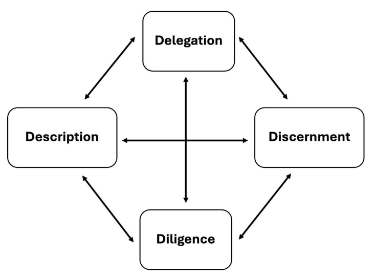

# Framework para Fluência em IA: Documento de Visão Geral Prática
### Tradução Português Brasileiro

**Versão Original**: 1.1 (13 de Janeiro de 2025)

**Versão Atual**: Este é um documento vivo. A versão mais recente em inglês pode ser baixada em [https://ringling.libguides.com/aiframework](https://ringling.libguides.com/aiframework).

**Autores**: Rick Dakan (Professor de Escrita Criativa, Coordenador de IA, Ringling College of Art and Design, rdakan@c.ringling.edu) e Joseph Feller (Professor de Sistemas de Informação e Transformação Digital, Cork University Business School, University College Cork, Irlanda, jfeller@ucc.ie)

**Revisor da Tradução Técnica**: Leonardo Alves

**Data da Tradução**: 13 de Julho de 2025

**Licença**: CC BY-NC-ND 4.0 [https://creativecommons.org/licenses/by-nc-nd/4.0/](https://creativecommons.org/licenses/by-nc-nd/4.0/)

---

## 1. Sobre Este Documento

O Framework para Fluência em IA resumido neste documento surgiu de uma colaboração de pesquisa contínua entre o Prof. Rick Dakan, do Ringling College of Art and Design, Flórida, e o Prof. Joseph Feller, da Cork University Business School, University College Cork, Irlanda, explorando as interseções entre IA, criatividade, inovação e aprendizado.

O framework foi (e continua sendo) baseado no projeto e na oferta contínuos de cursos para alunos, bem como de seminários e workshops para o corpo docente, tanto no Ringling College of Art and Design quanto na Cork University Business School, nos anos acadêmicos de 2023/2024, 2024/2025 e 2025/2026.

Este documento apresenta uma visão geral do framework como uma ferramenta prática projetada para embasar o discurso e a prática no ensino superior sobre elaboração de currículos e avaliações, a definição de políticas acadêmicas, a empregabilidade de estudantes e orientação de carreira, e tópicos semelhantes no contexto da disrupção digital da IA (e particularmente da GenAI).

Embora voltado principalmente para o ensino superior, imaginamos que o framework, nesta forma, também beneficiará outros níveis educacionais e organizações em geral que enfrentam os desafios e oportunidades da GenAI.

---

## 2. Visão Geral do Framework

O Framework para Fluência em IA descreve as competências interconectadas necessárias para usar a IA em trabalhos criativos, inovadores e de resolução de problemas. Em vez de ver a IA apenas como um motor de eficiência, o framework reconhece o potencial da IA como um parceiro de pensamento autêntico para realizar trabalhos cognitivos significativos, ao mesmo tempo que reconhece que esse potencial só pode ser alcançado por meio do desenvolvimento e desempenho de competências humanas específicas.

Definimos Fluência em IA como a capacidade de trabalhar de forma eficaz, eficiente, ética e segura dentro das modalidades emergentes de interação Humano-IA. Na sua versão atual, o framework identifica três modalidades de interação (modalities) observáveis no estado da arte atual.

### Modalidade 1: Automação (Automation) (IA Realiza Tarefa Definida por Humanos)

- A IA executa tarefas de forma independente, mas com base em instruções humanas diretas (por exemplo, em resposta a um prompt).
- Esta modalidade é particularmente útil para melhorar a eficiência de tarefas repetitivas, demoradas ou intensivas em dados.
- Requer definição clara de tarefas e medidas de controle de qualidade.
- Exemplos: E-mails, resumos, postagens em redes sociais, codificação básica.

### Modalidade 2: Aumento (Augmentation) (IA e Humano Realizam Tarefa Colaborativamente)

- A IA e o humano co-definem e co-executam tarefas de forma iterativa, colaborando para alcançar um objetivo final.
- Esta modalidade foca em aprimorar a criatividade humana, em vez de substituí-la, por meio da adição de um parceiro de pensamento de IA.
- Envolve uma interação dinâmica entre contribuições humanas e da IA.
- Exemplos: Escrever histórias, ensaios, artigos de pesquisa, tarefas complexas de codificação.

### Modalidade 3: Agência (Agency) (Humano Configura IA para Realizar Tarefas Independentemente)

- O humano configura a IA para realizar tarefas futuras de forma independente (inclusive para outros) em nome do usuário.
- Esta modalidade define as características e o comportamento futuro de uma IA, em vez de uma tarefa específica.
- Requer uma compreensão sofisticada das capacidades e limitações da IA.
- Exemplos: Personagens interativos de jogos, tutores, chatbots.

As interações Humano-IA frequentemente cruzam múltiplas modalidades (modalities), e os praticantes frequentemente transitam entre contextos, mesmo dentro de projetos ou fluxos de trabalho únicos.

O framework identifica quatro competências centrais (descritas na seção 3) que permitem aos praticantes:

- Tomar decisões apropriadas sobre se, quando e como usar ferramentas de IA,
- Comunicar efetivamente os resultados e comportamentos desejados aos sistemas de IA,
- Avaliar com precisão a qualidade e adequação dos resultados e comportamentos da IA,
- Garantir práticas éticas, transparência e responsabilidade.

Acreditamos que o framework oferece várias vantagens principais:

- **Agnóstico de Plataforma e Tecnologia**: Independente de ferramentas ou plataformas específicas, adaptável a tecnologias e casos de uso emergentes e em rápida evolução.

- **Contextual e Flexível**: Caracteriza ações eficazes em vez de prescrever processos rígidos, sendo compatível com outras taxonomias de habilidades em diversos contextos profissionais.

- **Centrado em Ética**: Trata as considerações éticas como fundamentais, reconhecendo que o uso responsável e seguro da IA é tão importante quanto o design responsável e seguro da IA.

---

## 3. Competências Centrais em IA ("Os 4 Ds")

As quatro competências centrais (Figura 1) descrevem as habilidades, conhecimentos e valores humanos interconectados que permitem uma interação Humano-IA eficaz, eficiente, ética e segura.

### Delegação (Delegation) - Visão criativa e seleção das ferramentas e técnicas de IA certas para realizar essa visão.

Delegação refere-se à capacidade de identificar quando e como usar ferramentas e modalidades (modalities) de IA de forma eficaz em processos criativos e de resolução de problemas. Envolve compreender as capacidades e limitações de várias tecnologias de IA e tomar decisões informadas sobre quando usar a IA para automação (automation), aumento (augmentation) ou experiências mediadas por agentes independentes (agency).

#### Subcategorias:

a) **Consciência de Objetivo e Tarefa**:
   - Capacidade de analisar e desconstruir uma tarefa em componentes de IA, humanos e colaborativos.
   - Compreensão da natureza e dos requisitos da(s) tarefa(s) para atingir o objetivo definido.
   - Necessário para a integração eficaz da IA em fluxos de trabalho criativos.

b) **Consciência de Plataforma**:
   - Compreensão das capacidades e limitações das ferramentas de IA atuais.
   - Capacidade de avaliar ferramentas de IA com base nos requisitos do projeto, orçamento, necessidades operacionais e regulatórias.
   - Necessário para selecionar as ferramentas de IA ideais para tarefas específicas.

c) **Delegação de Tarefas**:
   - Equilibrar capacidades de IA e humanas ao longo de um projeto para melhor realizar a visão criativa.
   - Compreensão das diferentes affordances de cada modalidade (automation, augmentation, agency).
   - Capacidade de atribuir tarefas do projeto a ferramentas humanas e de IA de forma otimizada.
   - Necessário para uma colaboração bem-sucedida entre humano e IA em processos criativos.

### Descrição (Description) - Descrever efetivamente uma visão e/ou tarefas para estimular comportamentos e resultados úteis da IA.

Descrição abrange as habilidades necessárias para comunicar ideias, requisitos, restrições e outros aspectos de visões criativas para sistemas de IA de forma eficaz. Envolve criar prompts claros, específicos e bem estruturados (usando uma ampla gama de técnicas de prompting) e outros elementos que guiam ferramentas de IA para produzir comportamentos e resultados desejados.

#### Subcategorias:

a) **Descrição do Produto**:
   - Capacidade de articular claramente as características, recursos e qualidades desejadas do resultado gerado pela IA.
   - Habilidade em traduzir a visão criativa em termos explícitos compreensíveis pela IA.
   - Crucial para orientar ferramentas de IA a produzir resultados alinhados com as intenções do criador.

b) **Descrição do Processo**:
   - Prompting dialógico para produzir colaboração iterativa eficaz.
   - Capacidade de engajar em comunicação dinâmica e bidirecional com ferramentas de IA.
   - Habilidade em dividir tarefas complexas em uma série de prompts menores e gerenciáveis.
   - Essencial para guiar a IA em processos criativos de múltiplas etapas alinhados com o colaborador humano.

c) **Descrição de Desempenho**:
   - Prompting diretivo para definir comportamentos futuros da IA e permitir uma experiência positiva ao usuário.
   - Capacidade de definir como o conteúdo ou sistemas gerados pela IA devem se comportar ou interagir com o mundo.
   - Habilidade em antecipar as necessidades do usuário e traduzi-las em diretrizes para o comportamento da IA.
   - Crítico para possibilitar comportamentos agenciais orientados por IA que estejam alinhados com a visão e os valores humanos.

### Discernimento (Discernment) - Avaliar se os comportamentos independentes orientados por IA permitem experiências positivas ao usuário e como direcionar melhor a IA para melhorar os resultados.

Discernimento refere-se à capacidade de avaliar a eficácia dos sistemas de IA em cenários independentes voltados para o usuário. Envolve coletar e interpretar feedback humano para refinar e garantir comportamentos e experiências orientadas por IA alinhadas com a visão e os valores do projeto.

#### Subcategorias:

a) **Discernimento de Desempenho**:
   - Avaliar se os comportamentos independentes orientados por IA permitem experiências positivas ao usuário e como direcionar melhor a IA para melhorar os resultados.
   - Capacidade de avaliar a eficácia dos sistemas de IA em cenários independentes voltados para o usuário.
   - Habilidade em coletar e interpretar feedback humano para refinar e garantir comportamentos e experiências orientadas por IA.
   - Essencial para projetar experiências de usuário alinhadas com a visão e os valores do projeto.

### Diligência (Diligence) - Assumir responsabilidade e garantir a qualidade dos produtos finais criados com IA.

Diligência refere-se ao uso responsável da IA, incluindo considerações éticas, transparência sobre o uso da IA e assunção de responsabilidade pelos produtos finais criados com assistência da IA.

#### Subcategorias:

a) **Diligência na Criação**:
   - Uso responsável de ferramentas de IA, mantendo práticas éticas e legais, consciência de vieses, falhas, impactos nas partes interessadas e outras externalidades.
   - Compreensão e aplicação de princípios éticos ao longo do processo criativo assistido por IA.
   - Capacidade de identificar e mitigar potenciais vieses e riscos éticos em conteúdos gerados por IA.
   - Crucial para garantir o uso responsável e socialmente consciente da IA.

b) **Diligência na Transparência**:
   - Transparência e responsabilidade na distribuição do produto final.
   - Compreensão das expectativas e normas da audiência, indústria e legais em relação ao conteúdo gerado por IA.
   - Habilidade em comunicar claramente a natureza do envolvimento da IA no processo.
   - Essencial para manter a confiança e a integridade ao distribuir trabalhos assistidos por IA.

c) **Diligência na Implantação**:
   - Assumir responsabilidade por verificar e garantir a qualidade dos resultados assistidos por IA, incluindo verificação de fatos, testes de precisão e validação de alegações.
   - Implementação de verificações de segurança e procedimentos de teste apropriados antes de liberar trabalhos assistidos por IA.
   - Compreensão, gerenciamento e assunção de responsabilidade pelos riscos e impactos potenciais de conteúdos e/ou agentes assistidos por IA implantados.
   - Essencial para garantir a qualidade, segurança e confiabilidade de conteúdos e/ou agentes criados por meio da interação Humano-IA.

---

## Declaração de Diligência

Na criação deste documento, utilizamos Claude 3.5 Pro para auxiliar na criação e refinamento de texto. Afirmamos que todo o conteúdo gerado e co-criado por IA passou por edição e curadoria completas pelos coautores humanos. O documento final reflete nossa compreensão, experiência e significado pretendido. Embora as ferramentas de IA tenham sido instrumentais no processo de escrita, mantemos total responsabilidade pelo conteúdo, sua precisão e sua apresentação. Esta divulgação é feita no espírito de transparência e para reconhecer o papel evolutivo da IA na criação de conteúdo e outros trabalhos intelectuais.

### Tradução para Português-br
Este documento foi traduzido com o auxílio do modelo de linguagem Grok 3, desenvolvido pela xAI. Todo o conteúdo traduzido foi revisado e editado por humano para garantir precisão, clareza e fidelidade ao texto original.

